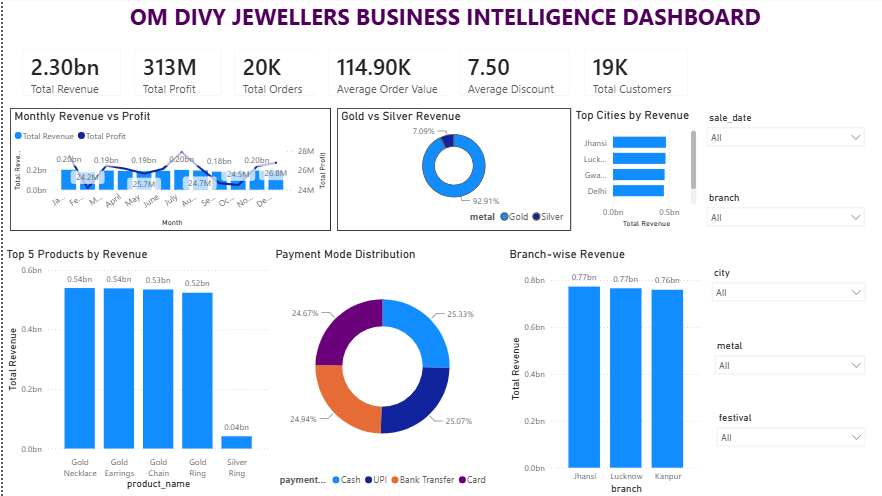

# 💎 Om Divy Jewellers — Business Intelligence & Sales Analytics


## 📌 Project Overview

Om Divy Jewellers Business Intelligence is an end-to-end data analytics project developed to analyze jewellery sales, revenue, profit, customer behavior, product performance, branch performance, and payment methods.

The project transforms raw jewellery sales data into meaningful business insights using Python, SQL, Excel, and Power BI.

An interactive Power BI dashboard was created to help understand business performance and support data-driven decision-making.

---

## 🎯 Project Objectives

- Analyze overall sales and revenue performance
- Measure total revenue and profit
- Compare Gold and Silver sales performance
- Identify top-performing jewellery products
- Analyze branch-wise revenue
- Analyze city-wise sales performance
- Understand payment mode distribution
- Track monthly revenue and profit trends
- Analyze customer and order metrics
- Build an interactive Power BI dashboard
- Generate actionable business insights

---

## 🗂️ Dataset

The dataset contains **20,000 jewellery sales records**.

### Key Columns

- Sale Date
- Product Name
- Category
- Metal
- Weight
- Quantity
- Making Charge
- Price
- Discount
- Profit
- Total Amount
- Payment Mode
- Branch
- City
- Festival

The dataset was generated using Python to simulate realistic jewellery business transactions.

---

## 🛠️ Tools & Technologies

| Tool | Purpose |
|---|---|
| Python | Dataset generation and data processing |
| Pandas | Data manipulation |
| Faker | Synthetic data generation |
| MySQL | Database creation and SQL analysis |
| SQL | Business queries and KPI calculations |
| Excel | Data analysis and validation |
| Power BI | Interactive dashboard and visualization |
| GitHub | Project documentation and version control |

---

## 🔄 Project Workflow

```text
Raw Sales Data
      ↓
Python Data Generation
      ↓
CSV Dataset
      ↓
MySQL Database
      ↓
SQL Analysis
      ↓
Excel Analysis
      ↓
Power BI Dashboard
      ↓
Business Insights
```

---

## 📊 Key KPIs

| KPI | Value |
|---|---:|
| Total Revenue | ₹2.30 Billion |
| Total Profit | ₹313 Million |
| Total Orders | 20K |
| Average Order Value | ₹114.90K |
| Average Discount | 7.50 |
| Total Customers | 19K |

---

## 📈 Power BI Dashboard



The Power BI dashboard provides an interactive view of the jewellery business performance.

### Dashboard Features

- Total Revenue
- Total Profit
- Total Orders
- Average Order Value
- Average Discount
- Total Customers
- Monthly Revenue vs Profit
- Gold vs Silver Revenue
- Top 5 Products by Revenue
- Payment Mode Distribution
- Branch-wise Revenue
- Top Cities by Revenue
- Interactive Filters

### Available Filters

- Sale Date
- Branch
- City
- Metal
- Festival

---

## 💡 Key Business Insights

### 1. Strong Overall Revenue Performance

The business generated approximately **₹2.30 Billion in total revenue** with **₹313 Million in total profit**, indicating strong overall financial performance.

### 2. Gold is the Primary Revenue Driver

Gold products contribute approximately **92.91% of total revenue**, while Silver contributes approximately **7.09%**.

This indicates that the business is highly dependent on gold sales.

### 3. High Average Order Value

The average order value is approximately **₹114.90K**, indicating that customers generally make high-value jewellery purchases.

### 4. Gold Products Dominate Top Sales

The top revenue-generating products are:

- Gold Necklace
- Gold Earrings
- Gold Chain
- Gold Ring

These products generate approximately **₹0.52–₹0.54 Billion** each.

### 5. Silver Ring Has Lower Revenue Contribution

Silver Ring generates approximately **₹0.04 Billion** in revenue, significantly lower than the major gold products.

### 6. Balanced Branch Performance

Jhansi, Lucknow, and Kanpur show relatively balanced revenue performance, with each branch generating approximately **₹0.76–₹0.77 Billion**.

### 7. Balanced Payment Mode Distribution

Cash, UPI, Bank Transfer, and Card show a relatively balanced distribution in the dashboard.

---

## 🧮 SQL Analysis

SQL was used to perform business analysis such as:

- Total revenue calculation
- Total profit calculation
- Monthly sales analysis
- Product-wise revenue
- Branch-wise revenue
- City-wise revenue
- Gold vs Silver analysis
- Payment mode analysis
- Customer analysis
- Top-performing products

---

## 🐍 Python Data Generation

Python was used to generate a realistic jewellery sales dataset containing **20,000 records**.

### Python Libraries

```python
pandas
faker
random
datetime
```

The generated dataset was exported as a CSV file and used for SQL, Excel, and Power BI analysis.

---

## 📊 Business Recommendations

Based on the analysis, the following recommendations can help improve business performance:

- Continue focusing on high-performing Gold products.
- Increase marketing efforts for Silver products.
- Promote low-performing products through discounts and seasonal campaigns.
- Analyze customer preferences by city and branch.
- Encourage digital payment adoption.
- Use monthly revenue trends to plan inventory and promotional campaigns.
- Focus on high-value customers and repeat purchases.

---

## 🚀 Future Improvements

Future versions of the project can include:

- Customer segmentation using RFM analysis
- Sales forecasting using Machine Learning
- Profit margin analysis
- Inventory analysis
- Customer lifetime value analysis
- Automated Power BI data refresh
- Advanced geographical analysis
- Predictive sales analytics

---

## 📁 Project Structure

```text
OmDivyJewellers_Analytics/
│
├── dataset/
│   └── sales_data.csv
│
├── docs/
│   ├── README.md
│   └── screenshot/
│       └── om_divy_jewellers_dashboard.png
│
├── excel/
│   └── sales.csv
│
├── power_bi/
│   └── OmDivyJewellers_Business_Intelligence.pbix
│
├── python/
│   └── generate_dataset.py
│
└── sql/
    ├── 01_create_database.sql
    ├── 02_create_tables.sql
    ├── 03_insert_data.sql
    └── 04_analysis_queries.sql
```

---

## 👩‍💻 Author

**Kumkum Soni**

MCA | Data Analytics & Business Intelligence Enthusiast

### Skills

- Python
- SQL
- MySQL
- Excel
- Power BI
- Data Visualization
- Business Analytics

---

## ⭐ Project Highlights

This project demonstrates an end-to-end analytics workflow:

**Data Generation → Data Processing → SQL Analysis → Excel Analysis → Power BI Visualization → Business Insights**

The project showcases practical skills in **Data Analytics, SQL, Python, Excel, Power BI, Dashboard Development, and Business Intelligence.**